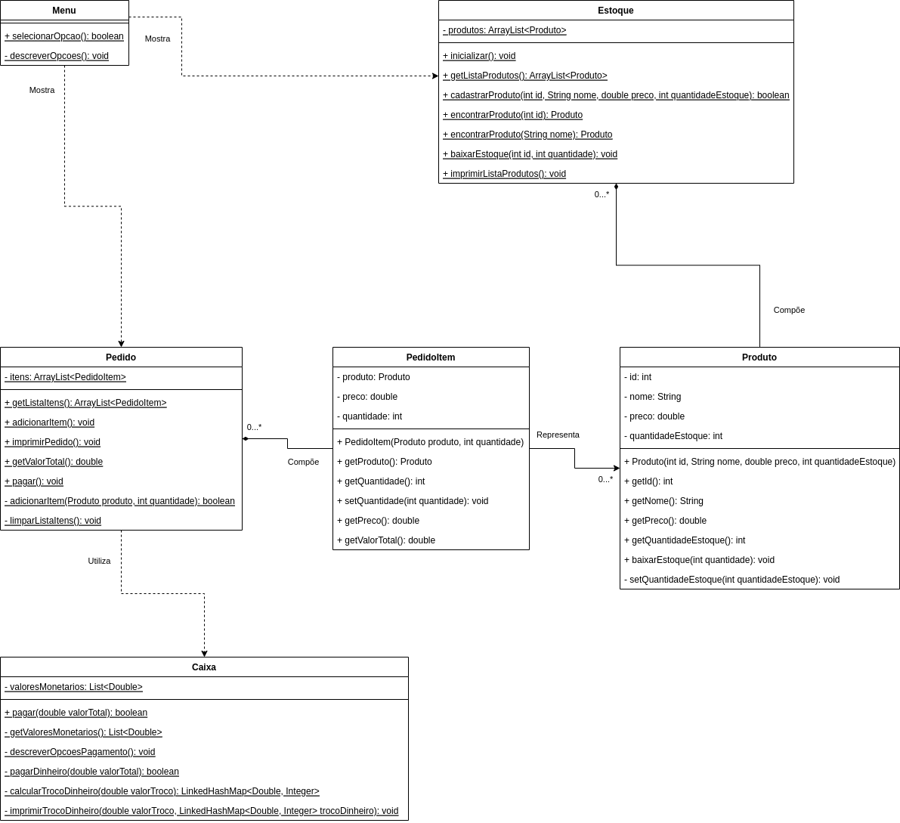

# Desafio - Sistema Ponto de Venda (PoS - Point of Sale)

O Sistema Ponto de Venda (PoS - Point of Sale) simula um módulo de frente de caixa de supermercado integrado com o respectivo cadastro de produtos, controlando também seus estoques, em que baixas são dadas sempre que uma venda é concluída.

## Visão geral



## Getting started

### Pré-requisitos

- [Java SE Development Kit 11](https://www.oracle.com/br/java/technologies/downloads/#java11) ou superior

### Workspace

O workspace contém a seguinte estrutura:

```shell
.
├── bin
├── lib
├── resources
└── src
    └── utils
```

- `bin` - Local da *saída* da compilação
- `lib` - Local das dependências de projeto
- `resources` - Local de arquivos utilitários (ex.: arquivos de dados)
- `src` - Local dos arquivos de código fonte da codebase

> [!NOTE]
> - `lib` não existirá se o projeto não tiver dependências
> - `bin` não é versionado, logo só existirá *localmente*, conforme especificado abaixo

### Executando o projeto

#### 1. Via terminal de comandos

Criar o diretório `bin` se ele já não existir
```shell
mkdir bin
```
> [!NOTE]
> O comando de criação de diretório pode variar dependendo do SO

Compilar os arquivos de código fonte de `src` para dentro do diretório `bin`
```shell
javac -cp "src" -d "bin" src/App.java
```
Executar a classe `App` (main) compilada dentro do diretório `bin`
```shell
java -cp "bin" App
```

## Desafio

### 1. Issue Report

Os operadores do Sistema PoS têm reportado que quando lançam uma venda para o cliente retirar mais tarde, quando o cliente chega para pegar os produtos, identifica-se que *não existem mais produtos em estoque*, e olhando o sistema, o *estoque está negativo*. É necessária uma investigação detalhada para correção do comportamento defeituoso.

### 2. Feature Request

#### História de Usuário (US - User Story):

Cálculo de troco detalhado

#### Descrição:

>**Como** um operador do Sistema PoS **quero que** o sistema calcule o valor do troco para pagamentos em dinheiro de forma precisa e detalhada, levando em consideração a *forma mais otimizada possível* de fornecer o troco em cédulas e moedas **para que** eu saiba exatamente quais cédulas e moedas devo entregar ao cliente, e consiga fazê-lo sem prejudicar o caixa.

#### Critérios de Aceitação:

- Quando o operador lança um pedido e sinaliza pagamento em dinheiro, o sistema deve calcular o valor do troco de forma precisa e livre de erros
- O sistema deve comparar o valor total do pedido com o valor pago em dinheiro e determinar se há troco (diferença entre valor pago e valor total do pedido)
- O sistema deve calcular o troco considerando as seguintes opções (R$):
  - Cédulas: 200, 100, 50, 20, 10, 5 e 2
  - Moedas: 1, 0.50, 0.25, 0.10, 0.05 e 0.01
- O sistema deve determinar a combinação *mais otimizada* possível, o que significa a *menor quantidade possível* de cédulas e moedas
- O valor do troco deve ser expresso de forma clara e detalhada, indicando a quantidade das cédulas e moedas a serem entregues
- O sistema deve ser capaz de lidar com diferentes valores de pedido e pagamentos em dinheiro

#### Definição de Pronto (DoD - Definition of Done):

- Funcionalidade **Cálculo de troco detalhado** implementada e testada com sucesso
- Sistema fornece a combinação *mais otimizada possível* de cédulas e moedas para o troco
- A interface do usuário exibe o valor do troco de maneira clara e detalhada
- O sistema está em conformidade com os critérios de aceitação definidos
